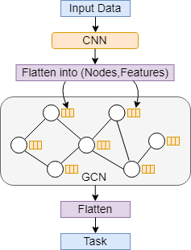

## Code for the paper: Multivariate Time Series Regression with Graph Neural Networks

### Authors: Stefan Bloemheuvel, Jurgen van den Hoogen, Dario Jozinovic, Alberto Michelini and Martin Atzmueller

### This is the anonymized page that will be freely assessible in the future.
### This page is also under construction
--------------------------

#### Data
The data (too big to host on github itself) can be downloaden at: https://zenodo.org/record/5767221    
In the data folder, the input_ci.npy file should be placed   
The input_cw.npy file should be placed in data/othernetwork   

#### Requirements
Tensorflow   
Spektral   
Networkx   

#### How to run

Run either main_cnn.py or main_gcn.py with the sys argument 'network1' or 'network2' in terminal.  
However, it could be that you have to run it as: network1 without the quotation marks!
If you want to also see how the graph is generated, graph_maker.py could be run as well.   

 

    
 

