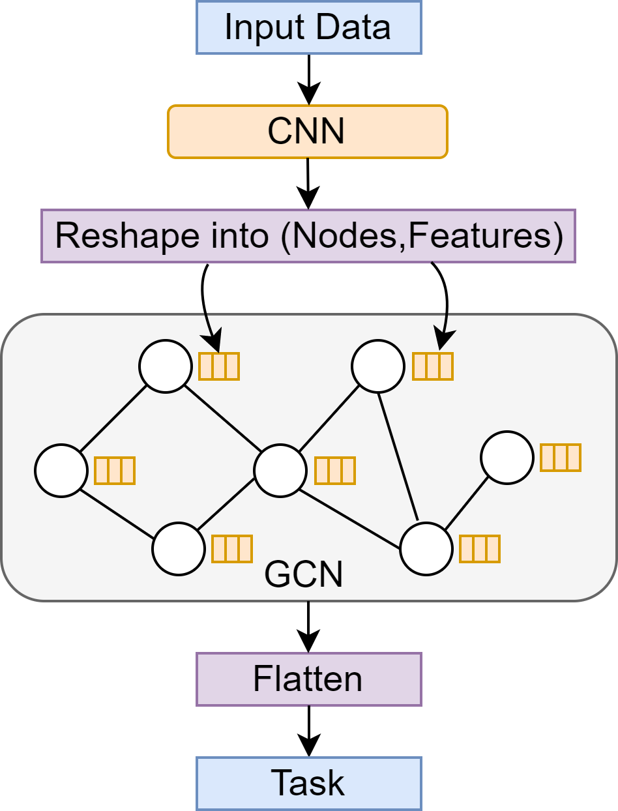
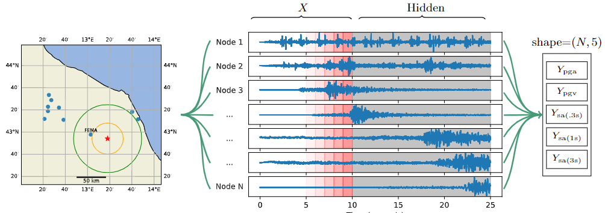

# Graph Neural Networks for Multivariate Time Series Regression with Application to Seismic Data

### Authors: Stefan Bloemheuvel, Jurgen van den Hoogen, Dario Jozinovic, Alberto Michelini and Martin Atzmueller

--------------------------
 <p align="center">
    
 </p>

## Data
The data (too big to host on github itself) can be downloaded at: https://zenodo.org/record/5767221  <br /> 
In the data folder, the input_ci.npy file should be placed <br /> 
The input_cw.npy file should be placed in data/othernetwork <br /> 

## Requirements
* geopy==2.2.0 
* keras==2.8.0
* networkx==2.7.1 
* numba==0.56.2 
* numpy==1.22.3
* scikit-learn==1.0.2
* scipy==1.8.0
* sklearn==0.0
* spektral==1.1.0 
* tensorflow==2.8.0

## How to run
Run either main_cnn.py or main_gcn.py with the sys argument 'network1' or 'network2' in terminal, following the with 'nofeatures' or 'main' for the main version. Lastly, a number that serves as the random state for the split.<br /> 


Example:
```
$ python main_gcn.py network1 main 1
```

Here, 'network1' refers to the CI network, 'main' refers to running the main experiment and '1' refers to a seed which can be used.

  <p align="center">
    

## Results
| Type        | Method                           | PGA MAE | PGA MSE | PGA RMSE | PGV MAE | PGV MSE | PGV RMSE | PSA03 MAE | PSA03 MSE | PSA03 RMSE | PSA1 MAE | PSA1 MSE | PSA1 RMSE | PSA3 MAE | PSA3 MSE | PSA3 RMSE |
|-------------|----------------------------------|---------|---------|---------|---------|---------|----------|-----------|-----------|------------|---------|---------|----------|---------|---------|----------|
| **CI Network** |                                  |         |         |          |         |         |          |           |           |            |         |         |          |         |         |          |
| SVM         |                                  | 0.43    | 0.36    | 0.60     | 0.47    | 0.43    | 0.65     | 0.47      | 0.41      | 0.64       | 0.44    | 0.37    | 0.61     | 0.45    | 0.40    | 0.63     |
| KNN         |                                  | 0.41    | 0.32    | 0.56     | 0.44    | 0.37    | 0.61     | 0.45      | 0.37      | 0.61       | 0.43    | 0.35    | 0.59     | 0.44    | 0.38    | 0.62     |
| XGBoost     |                                  | 0.38    | 0.28    | 0.53     | 0.41    | 0.32    | 0.57     | 0.42      | 0.33      | 0.57       | 0.41    | 0.31    | 0.56     | 0.41    | 0.33    | 0.58     |
| RF          |                                  | 0.38    | 0.28    | 0.53     | 0.41    | 0.32    | 0.57     | 0.42      | 0.33      | 0.57       | 0.41    | 0.31    | 0.56     | 0.41    | 0.33    | 0.57     |
| GAT |                         | 0.39    | 0.30    | 0.54     | 0.36    | 0.26    | 0.49     | 0.36      | 0.26      | 0.49       | 0.38    | 0.28    | 0.52     | 0.37    | 0.28    | 0.52     |
| Jozinovic et al. | | 0.34    | 0.22    | 0.46     | 0.35    | 0.26    | 0.50     | 0.36      | 0.24      | 0.48       | 0.35    | 0.26    | 0.49     | 0.36    | 0.25    | 0.49     |
| Kim et al. |  | 0.35    | 0.26    | 0.49     | 0.33    | 0.23    | 0.47     | 0.33      | 0.23      | 0.47       | 0.33    | 0.24    | 0.48     | 0.33    | 0.24    | 0.48     |
| **TISER-GCN** |                   | **0.31** | **0.20** | **0.44** | **0.32** | **0.21** | **0.45** | **0.31**  | **0.19**  | **0.43**   | **0.31** | **0.20** | **0.43**  | **0.32** | **0.21** | **0.45**  |
| **CW Network** |                                 |         |         |          |         |         |          |           |           |            |         |         |          |         |         |          |
| GAT |                         | 0.54    | 0.49    | 0.68     | 0.56    | 0.52    | 0.70     | 0.55      | 0.52      | 0.70       | 0.53    | 0.49    | 0.68     | 0.58    | 0.56    | 0.72     |
| SVM         |                                  | 0.51    | 0.43    | 0.66     | 0.56    | 0.51    | 0.71     | 0.60      | 0.58      | 0.77       | 0.56    | 0.51    | 0.72     | 0.47    | 0.40    | 0.63     |
| KNN         |                                  | 0.52    | 0.45    | 0.67     | 0.57    | 0.51    | 0.71     | 0.61      | 0.60      | 0.78       | 0.57    | 0.53    | 0.73     | 0.48    | 0.41    | 0.64     |
| XGBoost     |                                  | 0.50    | 0.42    | 0.65     | 0.54    | 0.48    | 0.69     | 0.59      | 0.57      | 0.75       | 0.55    | 0.51    | 0.72     | 0.46    | 0.39    | 0.62     |
| RF          |                                  | 0.49    | 0.40    | 0.63     | 0.54    | 0.47    | 0.68     | 0.58      | 0.56      | 0.75       | 0.55    | 0.50    | 0.71     | 0.46    | 0.39    | 0.62     |
| Kim et al | | 0.45    | 0.35    | 0.59     | 0.48    | 0.40    | 0.62     | 0.46      | 0.38      | 0.60       | 0.45    | 0.35    | 0.58     | 0.46    | 0.37    | 0.60     |
| Jozinovic et al. | | 0.44    | 0.35    | 0.58     | 0.46    | 0.37    | 0.59     | 0.44      | 0.35      | 0.58       | 0.48    | 0.40    | 0.62     | 0.45    | 0.36    | 0.58     |
| **TISER-GCN** |                   | **0.41** | **0.30** | **0.54** | **0.41** | **0.30** | **0.54** | **0.40**  | **0.29**  | **0.52**   | **0.42** | **0.31** | **0.54**  | **0.43** | **0.33** | **0.56**  |


## Cite

If you compare with, build on, or use aspects of this work, please cite the following:
```
@article{bloemheuvel2022graph,
  title={Graph neural networks for multivariate time series regression with application to seismic data},
  author={Bloemheuvel, Stefan and van den Hoogen, Jurgen and Jozinovic, Dario and Michelini, Alberto and Atzmueller, Martin},
  journal={International Journal of Data Science and Analytics},
  pages={1--16},
  year={2022},
  publisher={Springer}
}
```
